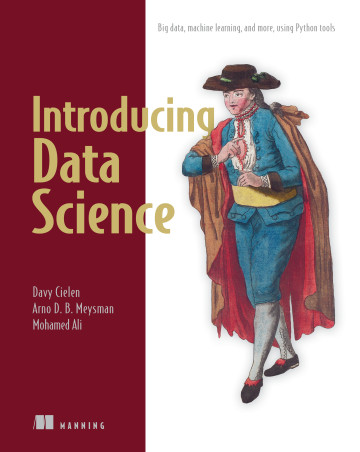

# 巨量資料導論
## Introduction to Big Data Analysis
Instructor: 林志偉 (Jacky Lin)
Material: https://github.com/mingfujacky/Lecture-Big-Data.git

# Textbook

- Introducing Data Science, Davy Cielen, Arno D. B. Meysman, and Mohamed Ali, Manning, 2016
- Big Data: Concepts, Technology, and Architecture, Balamurugan Balusamy, Nandhini Abirami. R, Seifedine Kadry, and Amir H. Gandomi, Wiley, 2021.
- Storytelling with Data, Cole Nussbaumer Knaflic, Wiley, 2015
- 商業智慧, 高昶易, 普林斯頓, 2024.

# Contact Information
- Instructor: 林志偉 jacky.jw.lin@nycu.edu.tw
- TA: 陳宗佑 joey76171.sc13@nycu.edu.tw 

# Course Objectives
- The course introduces students to a broad overview of big data and data science. 
- This course covers a briefing of various topics of big data ecosystem and big data analysis with focus on the open source and cloud-native solutions.

# Instructional Arrangements
- Explain course material and hold hands-on sessions in class (laptop is required).
- Implement examples and assignments in Python.
- Deliver final project in group or individual. The project topic is related to big data or data science.

# Evaluation Criteria
- Attendance(10%): 5 roll calls 
  - 2 points for full attendance
  - 1 point for excused absence (with approved leave)
  - 0 point for unexcused absence
- Homework (30%): 6 assignments will be given (late submissions will not be accepted)
- Mid-term exam (20%): closed-book written exam, covering the first half of the course.
- Final-term exam (20%): closed-book written exam, covering the entire course.
- Project (20%): 
  - (5%)  Progress report oral presentation: Week 9
  - (5%)  Final report oral presentation: Week 15
  - (10%) Submit final written report by Week 17 (don't be late)

# Course Schedule
[114 1st Semester](https://timetable.nycu.edu.tw/?r=main/crsoutline&Acy=114&Sem=1&CrsNo=520020&lang=)

# 大數據的應用 - 協同過濾推薦系統
為什麼我和朋友總刷到相同的視頻

# 大數據的應用 - 建立趨勢模型
點菜上雲端　大數據分析預測來客數

# 大數據的應用 - 消費者行為分析
零售科學：用大數據創造消費者驚奇

# 大數據的應用 - 風險控管
精密掌握製造流程

# Abuse Big Data Analytics - Cambridge Analytica
- 劍橋分析（Cambridge Analytica）是一家英國的數據分析公司，成立於2013年。該公司專注於利用數據挖掘和數據分析技術來影響選舉和政治活動。在2016年美國總統選舉期間，劍橋分析被指控利用社交媒體數據來微定向選民。
- 主要事件
  - 數據收集： 劍橋分析使用Facebook數據來分析選民行為，這一過程引發了有關隱私和數據保護的激烈討論
  - 影響力： 他們的策略被認為在美國、英國（支持脫歐公投）及其他國家的政治活動中發揮了重要作用
  - 醜聞： 在2018年3月爆發不當取得5000萬名Facebook用戶數據的醜聞而停業，並引發了全球範圍內對數據隱私和監管的反思
  - 影響： 劍橋分析事件促使各國政府加強對數據隱私的立法，並引發了對科技公司數據使用的廣泛討論

# 【Netflix 紀錄片】《個資風暴：劍橋分析事件》
正式預告片

你是如何被大数据+心理学操控的？

# Introduction to Big Data
Big Data In 5 Minutes: What Is Big Data and Big Data Analytics

# Introduction to Data Science
Data Science In 5 Minutes
