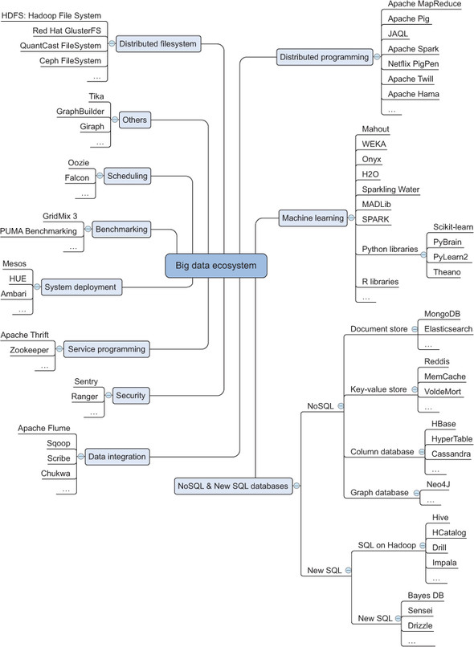
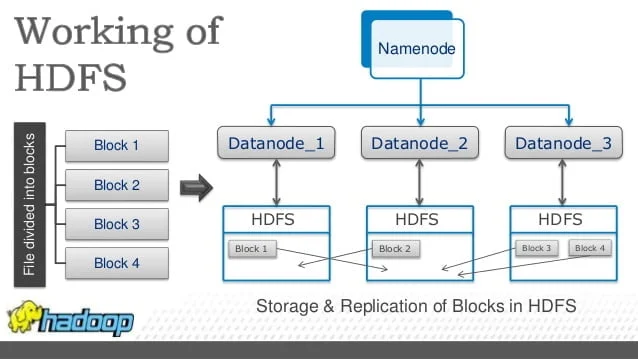

# Data Science in a Big Data World
- **Big data** is a term for any collection of data sets so large or complex that it becomes difficult to process them using traditional data management techniques, such as relational database management systems.
- **Data science** involves using methods to analyze massive amounts of data and extract the knowledge it contains. 

# Benefits and Uses of Data Science and Big Data

| **Benefit Area**                  | **Use Case / Application**|
|-----------------------------------|---------------------------|
| Business intelligence & marketing | Targeted advertising      |
|                                   | Campaign optimization     |
| Operations, risk & finance        | Fraud detection           |
|                                   | Operations optimization   |
| Public services & social good     | Government analytics & open data |
|                                   | National security & surveillance |
| Education & research              | Online learning analytics (MOOCs)|
|                                   | Scientific research acceleration |

# Big Data in Manufacturing

https://nextgeninvent.com/blogs/use-cases-of-big-data-in-manufacturing/

# Characteristics of Big Data
- **Volume**: How much data is there?
- **Variety**: How diverse are different types of data?
- **Velocity**: At what speed is new data generated?
- **Veracity**: How the quality and reliability of data? 
>The 4V make big data different from the data found in traditional data management tools.
>Big data calls for specialized techniques to capture, store, search, analyze data and extract the insights.

# Volume of Data
- By 2025, global data is projected to reach 181 zettabytes, with significant contributions from AI-driven content, social media, IoT devices, and cloud computing.
- Units of data size: kilobytes (KB), megabytes (MB), gigabytes (GB), terabytes (TB), petabytes (PB), exabytes (EB), and zettabytes (ZB).
- 1 ZB = 250 billion DVDs

# Variety of Data
- **Structured data** is data that depends on a data model and resides in a fixed field within a record.
- **Unstructured data** is information that is not organized in a pre-defined data model or schema.
- **Semi-structured data** is information that doesn’t follow a strict tabular structure of relational databases, but still contains organizational properties (eg. tags) that make it easier to analyze than unstructured data.

# Data Type Comparison Table

| **Type**            | **Structure**              | **Example Formats**                 |
|---------------------|----------------------------|-------------------------------------|
| Structured          | Rigid schema (tables)      | SQL databases (ed. MySQL), XLSX     |
| Unstructured        | No predefined schema       | TXT, MP3, MP4, JPG, PDF, DOCX       |
| Semi-structured     | Loose schema (tags/keys)   | JSON, XML, NoSQL (e.g., MongoDB)    |

How is Big Data classified?

# Velocity of Data
- Generate real-time or near-real-time data flow: data streams continuously, not in batches.
- Fulfill high-speed processing requirement: systems must analyze and act on data as it arrives.
- Impact on decision-making: faster insights to perform quicker, more relevant actions.

# Veracity of Data
- Data accuracy: data is correct
- Consistency: data is the same across systems
- Bias & noise: avoid irrelevant, misleading, or biased information
- Source credibility: data collected from reliable channels?

# The Big Data Ecosystem
>Total solutions to meet the challenges of big data like storage, processing, analysis, and visualization.

# Distributed File System
- DFS is similar to a normal file system except that DFS runs on multiple servers at once. 
- You can store, read, delete and secure files via DFS as you do in a standalone machine.
- A file in DFS will be divided into small blocks and stored on different servers. Hence, DFS can handle large files.
- DFS can replicate data across servers for fault tolerance or parallel operations.
- Hadoop Distributed File System (HDFS) is an example.

# Distributed Programming Framework
Instead of one machine doing all the work, distributed programming is a programming model where multiple computers work together on a single task by sharing work and communicating over a network. Hadoop MapReduce is a popular example of distributed programming.
1. Divide the task into smaller subtasks.
2. Distribute the subtasks to different nodes.
3. Execute them in parallel.
4. Communicate and synchronize results between nodes.
5. Combine the results into a final output.

# Hadoop Quick View
- Hadoop is an open-source framework for distributed storage and distributed processing of large datasets.
- It is designed to scale up from a single server to thousands of machines, each offering local computation and storage.
- The core components of Hadoop are:
  - Hadoop Distributed File System (HDFS): A distributed file system that stores data across multiple machines.
  - MapReduce: A programming model for processing large datasets in parallel.
  - YARN (Yet Another Resource Negotiator): A resource management layer for Hadoop that manages and schedules resources across the cluster.

# Hadoop Introduction
Hadoop In 5 Minutes: What Is Hadoop and Hadoop Ecosystem

# Scalability
Scalability is the ability of a system to handle a growing amount of work, or its potential growth.
- Scale up (vertical scaling): adding more power (CPU, RAM) to an existing machine.
- Scale out (horizontal scaling): adding more machines to a pool of resources
 

**Scale Up vs. Scale Out Data Storage**

**Differences of scaling methods**

# Data Integration Framework
Data integration is the process with tools of combining data from multiple sources to provide a single, unified view.
- Data Extraction: pulling data from each source
- Data Transformation: cleaning, formatting, and mapping data into a consistent schema
- Data Loading: storing data in a target system

# Machine Learning Framework
A machine learning (ML) framework is a software library or platform that simplifies the process of building ML models by providing pre-built algorithms, data preprocessing tools, and model evaluation metrics. Examples include TensorFlow, PyTorch, and Scikit-learn.
 

**AI, Machine Learning, Deep Learning**

**Machine Learning Explained in 100 Seconds**

# Failure of Traditional Database in Handling Big Data
- The Relational Database Management Systems (RDBMS) was the most common data storage medium until recently to store the data generated by the organizations
- To store exponential increase data volume, the RDBMS increased the number of processors and added more memory units, which in turn increased the cost.
- Almost 80% of the data fetched were of semi-structured and unstructured format, which RDBMS could not deal with.
- RDBMS could not capture the data coming in at high velocity.

# Compare Traditional Data and Big Data

| Attributes      | Traditional Data             | Big Data.                           |
|-----------------|------------------------------|-------------------------------------|
| Data store      | Relational database (RDB)    | Not only SQL (NoSQL)                |
| Data volume     | gigabytes to terabytes       | petabytes to zettabytes             |
| Organization    | centralized                  | distributed                         |
| Data type       | structured                   | unstructured and semi-structured    |
| Hardware type   | high-end model                | commodity hardware                 |
| Updates         | read/write many times         | write once, read many times        |

How is Big Data stored and processed 

# NoSQL Database
NoSQL (Not Only SQL), a category of databases designed to handle large-scale, unstructured, semi-structured data. It does not use relational model to manipulate data.
- Schema-less or flexible schema – You can store data without predefined table structures.
- Horizontal scalability – Easily add more servers to handle more data/traffic.
- High performance – Optimized for read/write speed at scale.
- Variety of data models – Key-value, document, column-family, graph.

# Compare RDB and NoSQL
Attribute | RDB                                  | NoSQL                                                                               |
|---------|--------------------------------------|-------------------------------------------------------------------------------------|
|Data model | Structured data with a rigid schema| Structured, Unstructured, Semi-Structured data with a flexible schema               |
|Storage structure| Storage in rows and columns  | Data stored in Key/Value DB, Columnar DB, Document DB, Graph DB|
|Scalability| Scale up                           | Scale out                                                                           |
|Example| Oracle, MySQL              | Redis, Cassandra, MongoDB, Neo4j                                                    |
|Query  | SQL language                   | Solution-specific method                                                            |

Battle of SQL and NoSQL 

# Scheduling Tools
Scheduling tools are used to automate the execution of tasks or workflows in a big data environment. They help manage dependencies, monitor job status, and ensure that tasks run at the right time.

# Benchmarking Tools
Benchmarking tools are used to measure the performance of big data systems and applications. They help identify bottlenecks, optimize resource usage, and ensure that systems meet performance requirements.

# System Deployment
System deployment involves the process of making a big data application or system operational in a production environment. This includes configuring hardware and software, setting up data pipelines, and ensuring that the system can handle real-world workloads.

# Service Programming
Service programming involves writing code to create and manage services that run on big data platforms. This includes developing APIs, microservices, and other components that enable data processing, analysis, and visualization.

# Security
Security in big data involves protecting data from unauthorized access, ensuring data integrity, and maintaining privacy. This includes implementing encryption, access controls, and monitoring tools to safeguard sensitive information.

# Hadoop EcoSystem
HDFS: Hadoop Distributed File System
YARN: Yet Another Resource Negotiator
MapReduce: Distributed data processing programming model
Spark -> In-memory distributed data processing
HBase -> NoSQL data store
Mahout, Spark MLlib -> machine learning
Zookeeper -> Managing cluster
Oozie -> Job scheduling
Flume, Sqoop -> Data ingesting services
Ambari -> Provision, monitor and maintain cluster

# Hadoop Ecosystem Frameworks

# Summary

- Big data is a blanket term for any collection of data sets so large or complex that it becomes difficult to process them using traditional data management techniques. They are characterized by the four Vs: velocity, variety, volume and veracity.
- Data science involves using methods to analyze small data sets to the gargantuan ones big data is all about.
- The big data landscape is more than Hadoop alone. It consists of many different technologies that can be categorized into the following:
  – File system
  – Distributed programming frameworks
  – Data integration
  – Databases
  – Machine learning
  – Security
  – Scheduling
  – Benchmarking
  – System deployment
  – Service programming
- Not every big data category is utilized heavily by data scientists. They focus mainly on the file system, the distributed programming frameworks, databases, and machine learning. They do come in contact with the other components, but these are domains of other professions.
- Data can come in different forms. The main forms are
  – Structured data
  – Unstructured data
  – Semi-structured data

# Review

# 1. Which of the following best describes Big Data?
A. Small datasets stored in relational databases
B. Data sets so large or complex that they are difficult to process using traditional methods
C. Data that only exists in text format
D. Data stored exclusively in spreadsheets

# 2. Which of the following is NOT part of the 4Vs of Big Data?
A. Volume
B. Variety
C. Velocity
D. Visualization

# 3. What is an example of semi-structured data?
A. MP3 audio file
B. JSON file
C. Excel table
D. SQL database

# 4. In a Distributed File System (DFS), data is:
A. Stored on a single centralized machine
B. Divided into blocks and stored across multiple servers
C. Only stored in the cloud
D. Encrypted and hidden by default

# 5. Which component of the Hadoop ecosystem stores data across multiple machines?
A. YARN
B. MapReduce
C. HDFS
D. Spark

# 6. Which scaling method means adding more machines to a system?
A. Scale up
B. Scale out
C. Scale in
D. Scale deep

# 7. Which of the following is an example of a Big Data processing framework?
A. MySQL
B. Hadoop MapReduce
C. Excel
D. SQLite

# 8. Which is a correct statement about NoSQL databases?
A. They require a rigid, predefined schema
B. They can store structured, semi-structured, and unstructured data
C. They cannot scale horizontally
D. They store data only in relational tables

# 9. Which part of the Hadoop ecosystem is used for job scheduling?
A. Oozie
B. Spark
C. Flume
D. HBase

# 10. Which of the following is an example of unstructured data?
A. XLSX spreadsheet
B. XML file
C. MP4 video file
D. JSON file
