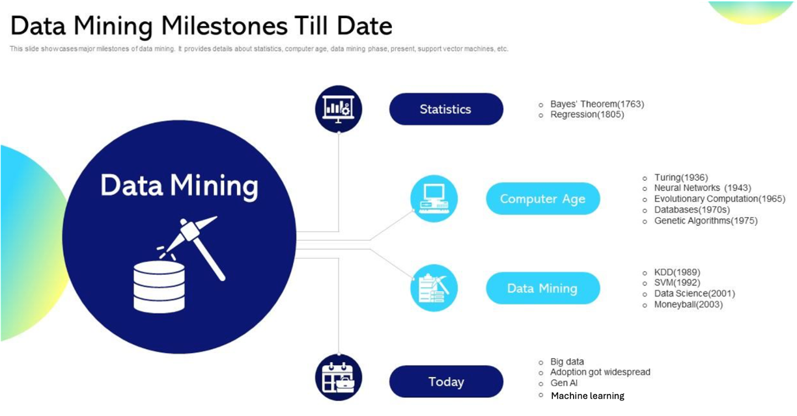
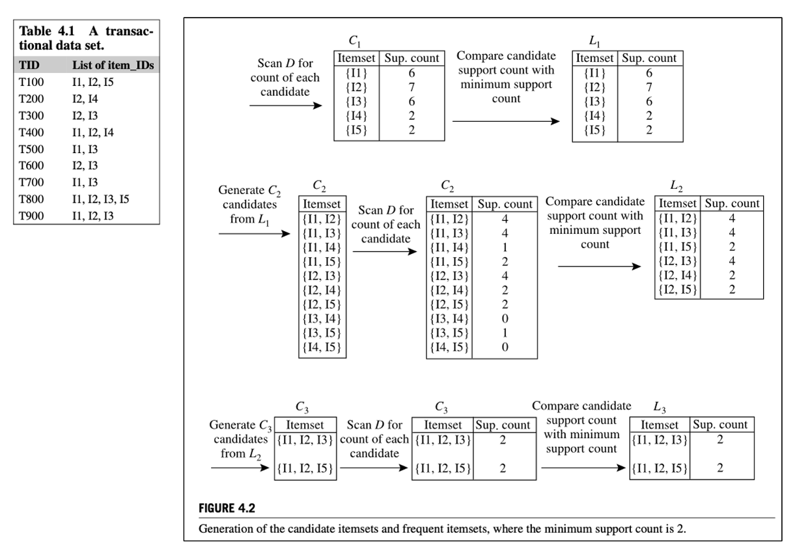
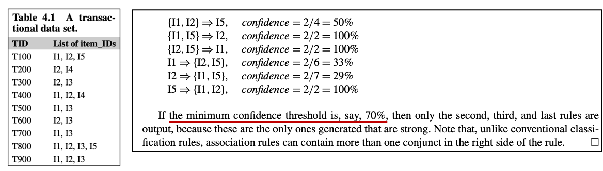

# Data mining: A Data Modeling Techniques

<div class="columns">
<div>

**Milestones of data mining**

</div>

<div>

**What is Data Mining?**
[](https://youtu.be/W7S7dQgvS4c?si=YHojS_YExApNFoKq)
</div>
</div>

* KDD: Knowledge Discovery in Database
* Data mining is to find anomalies, patterns, or correlations among data
* Data mining comprises three disciplines: statistic, AI, ML

# Data Mining Techniques
<div class="columns">
<div>


</div>
<div>

<span class="small-text">
<u>Associations & Relationships:</u> Finds patterns of items that frequently occur together.<br>  
<u>Classification Methods:</u> Assigns items into predefined categories based on attributes.<br>  
<u>Anomaly Detection:</u> Identifies unusual data points that don’t fit the general pattern.<br>  
<u>Time Series Analysis:</u> Analyzes data over time to detect trends, cycles, or seasonality.<br>  
<u>Predictive Modeling:</u> Builds models from historical data to forecast future outcomes.<br>  
<u>Text Mining:</u> Extracts useful information and patterns from unstructured text data.<br>
</span>  
</div>
</div>

# Frequent Itemset Mining Method 
- One <span class="blue-text">“pattern discovery” </span> method of associations & relationships techniques to reveal hidden associations in massive data. 
- In real life, we often face large volumes of transaction (like purchase records, credit card logs). These datasets may look messy, but they hide patterns of items that frequently occur together.
- <span class="blue-text">Frequent Itemset Mining</span> helps us to:
  - Find frequent combinations, eg. milk and bread often bought together.
  - Understand customer behaviors, preferences, and habits.
  - Support price setting and product bundling strategies.

# Basic Concept: Market basket analysis
> “Which groups or sets of items are customers likely to purchase on a given trip to the store?”

- Discover a <span class="blue-text">association rule</span>: 
  <u>*computer ⇒ antivirus_software [support= 2%,confidence= 60%]*</u>
- A support of 2% means that 2% of all the transactions under analysis show that computer and antivirus software are purchased together.
- A confidence of 60% means that 60% of the customers who purchased a computer also bought the software.
- Typically, association rules are considered interesting if they satisfy a **minimum support threshold** and a **minimum confidence threshold**. 
- These thresholds can be set by users or domain experts.

# Formula of Support and Confidence
$$
support(A \Rightarrow B) = P(A \cup B) \tag{buy both A and B}
$$
<br>

$$
confidence(A \Rightarrow B) = P(B|A) \tag{buy B given A}
$$
<br>

$$
confidence(A \Rightarrow B) = P(B|A) 
= \frac{support(A \cup B)}{support(A)} 
= \frac{support\_count(A \cup B)}{support\_count(A)}
$$

# Calculate Support and Confidence
Suppose we have 5 transactions, each recording the items a customer purchased:
```
T1: {Milk, Bread, Butter}
T2: {Beer, Bread}
T3: {Milk, Beer, Butter}
T4: {Milk, Bread, Beer}
T5: {Milk, Bread, Butter}
```
Support({Milk} ⇒ {Bread})
= Transactions containing {Milk, Bread} ÷ Total transactions = 3 / 5 = 0.6 (60%)

Confidence({Milk} ⇒ {Bread})
= Transactions containing {Milk, Bread} ÷ Transactions containing {Milk} = 3 / 4 = 0.75 (75%)

# Apriori Algorithm to Find Frequent Itemsets by Confined Candidate
<div class="columns">
<div>

Minimum support = 2


</div>
<div>

Minimum confidence = 70%

[](https://youtu.be/guVvtZ7ZClw?si=PHcBQFmdUUp6omPW)
</div>
</div>

# Case study: Frequent Itemset Mining
- Objective: identify potential product bundling opportunities.
- Dataset: transaction data from a retail store.
- Methodology
  1. Data Preprocessing: clean and preprocess the transaction data and convert transactions into a one-hot encoded format.
  2. Apply Apriori Algorithm: set minimum support and confidence thresholds and generate frequent itemsets and association rules.
- Marketing Decision Recommendations
   1. Design a “Milk + Bread” breakfast combo set.
   2. Place milk and bread in adjacent areas to increase cross-selling opportunities.
[apriori_association_rule.ipynb](file/code/apriori_association_rule.ipynb)

# Summary

# Homework

# Review 