# Data Science Process
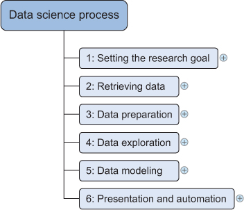

# Iterative, Not Strictly Linear
- Data science process is a structured approach to solving data problems efficiently.
- It improves collaboration and increases project success.
- It consists of <span class="blue-text">**six steps**</span>
  1. Define goal & communicate project charter (what, how, why) with stakeholder 
  2. Retrieve data by finding suitable data sources and getting access rights
  3. Prepare data and clean, integrate, transform them
  4. Data exploration to look for patterns, correlation, and deviation based on visual and descriptive techniques
  5. Build models via statistic, machine learning, or neural network techniques
  6. Present findings & build applications

# Six Steps of Data Science Process and Their Subtasks
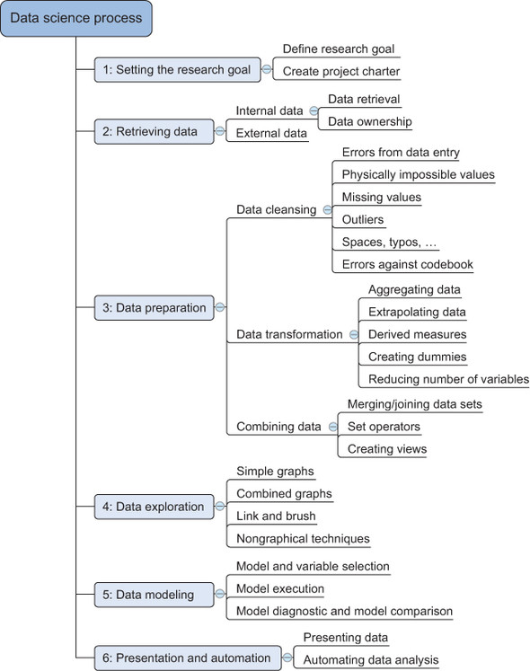

# #1: Goal and Project Charter
- Ask key questions to set goal
  - What company expect you to do? 
  - Why is this project important?  
  - How will you achieve the project goals?
- Deliver Project Charter to get authorizes
  - [Hsinchu City Library Data Analysis Project](file/doc/library_project_charter.pdf)

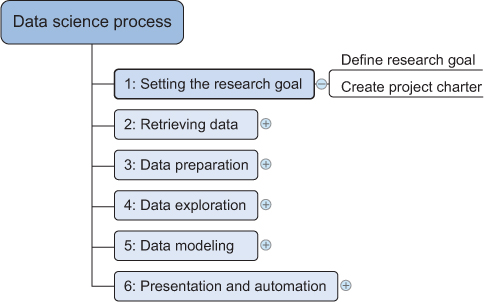

# #2: Retrieve Data
- Access internal sources
- Access external sources
- Evaluate data veracity

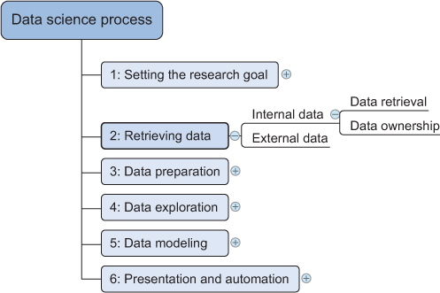

# Internal sources
- Logs, Engineering report ... (with CSV or JSON format)
- Databases, Data marts, Data warehouses, Data lakes
<br>


# Lab - Internal source file operation
[Handle CSV format](file/code/operate_csv_file.ipynb)
[Handle JSON format](file/code/operate_json_file.ipynb)

# Compare CSV and JSON format
| Feature        | CSV                          | JSON                         |
|----------------|------------------------------|------------------------------|
| Structure      | Tabular data                 | Hierarchical data (nested)           |
| Readability    | Easy to read and write       | More complex, but flexible   |
| Data Types     | Limited (strings, numbers)   | Supports various data types  |
| Size           | Generally smaller            | Can be larger due to structure|
| Use Cases      | Simple datasets, spreadsheets| Complex data, APIs           |  

# External sources
- Purchased data (eg. Semiconductor Market Research Reports)
- Open data (eg. https://data.gov.tw)
- APIs
```python
# Call GitHub API
import requests
url = "https://api.github.com/repos/mingfujacky/Lecture-Database"
response = requests.get(url)
data = response.json()
print(data['name'], data['stargazers_count'], 'stars')
```

# Evaluate data veracity (Data quality)
- Licensing and authorization
- Data availability, or whether you can get the data
- Data accuracy, or whether data is correct
- Data completeness, or data sets that include all the elements they should
- Data consistency, where the same data values stored in different systems are identical
- Degree of duplicate data records
- Data currency, meaning that the data is up to date
- Data conformity, meeting the required standard data formats defined by the organization

[](https://youtu.be/GWiiZWb69Sw?si=1QDq9bZKuHpd0o6k)

# Lab - YouBike Open Data Retrieval  
```python
import requests
from pathlib import Path

url = 'https://odws.hccg.gov.tw/001/Upload/25/opendataback/9059/59/5776ed30-fa3c-48f4-9876-d8fb28df0501.csv'
response = requests.get(url)
print(response.status_code)  # status_code: 200 代表成功 404 代表失敗
# response.encoding = 'utf-8'  # 如果回傳亂碼，可以設定編碼試試看

path = Path.cwd() /'..'/'file'/ 'csv' /'新竹市_YouBike_站點名稱.csv'
with open(path, 'w', encoding='utf-8') as f:
    f.write(response.text)
```
[進階題: 下載YouBike站點照片](file/code/download_open_data.ipynb)

# Lab - 證交所 OpenAPI Data Retrieval  
```python
import requests
import pandas as pd

# 定義證交所 API 的 URL
url = 'https://openapi.twse.com.tw/v1/exchangeReport/STOCK_DAY_ALL'  
response = requests.get(url)  

df = pd.DataFrame(response.json())
print(df.head()) # 顯示前5行數據
```
[進階題: 按收盤價排序並選取前10大收盤價的股票](file/code/api_get_stock.ipynb)

# #3: Clean, Integrate and Transform Data
- Clean: Remove duplicates, handle missing values, fix errors.
- Integrate (combine): merge multiple datasets.
- Transform: convert data from one format to another to make it more suitable for analysis, storage, or other uses.

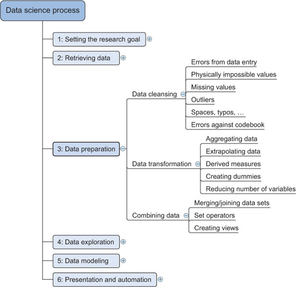

# <span class="blue-text">Clean</span> Data Errors
- Data having false value (age = 200)
- Data is inconsistency across different datasets. ('Female' in set A vs 'F' in set B)

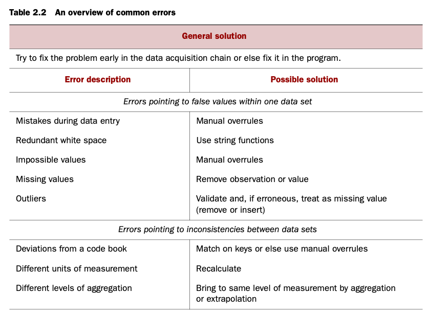

# Wrong Values
- "Good" vs "God", "O" vs "0", "i" vs "1"
- "FR" vs "FR "
- "Brazil" vs "brazil"
- "USA" vs "U.S.A" vs "United States"
- 2025-01-13 vs 2025/01/13 vs 2025.01.13 vs 01-13-2025 vs 13-01-2025
- "N/A", "None", "Unknown"
- Impossible value: age = 150
- Outliers
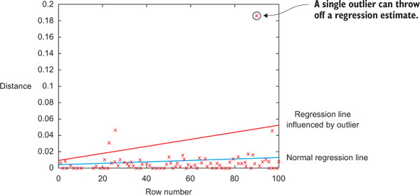

# Missing Values
Missing values aren’t necessarily wrong, but you still need to handle them separately; 
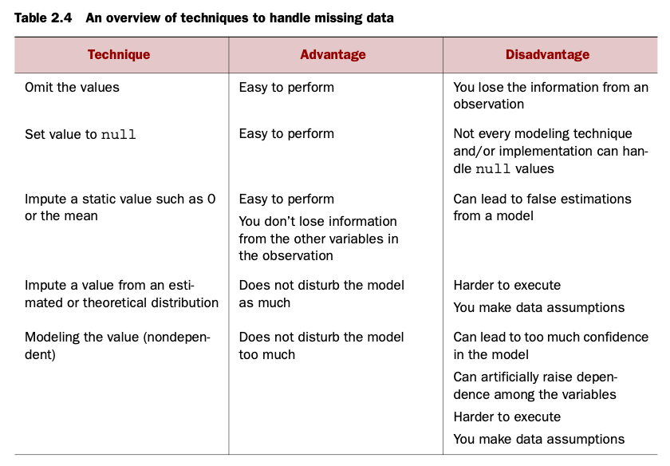
<span class="small-text">- If most of your “age” data follows a normal distribution with mean = 35 and standard deviation = 5, you can randomly draw new values for the missing entries from that same distribution.</span>
<span class="small-text">- You build a model (like regression, k-NN, or machine learning) to predict the missing value using other available variables — e.g., predict missing “income” based on “age,” “education,” and “job.”</span>


# Other Data Issues
- Duplicated values: same data appears multiple times
- Deviation from a code book: a codebook describes the layout of the data in the data file and describes what the data codes mean
- Different units of measurement: kilometers vs miles
- Different levels of aggregation: daily vs monthly sales
> Correct errors as early as possible

# <span class="blue-text">Combine</span> Data From Difference Data Sources
- Join: combine two datasets based on a common key
- Append: add rows from one dataset to another
- Derive: create new variables or features from existing ones

<div class="columns">
    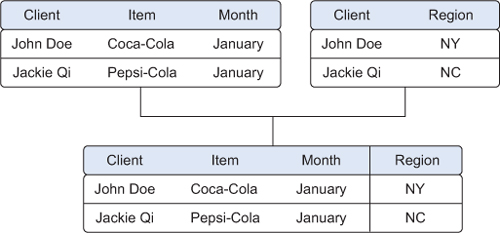
    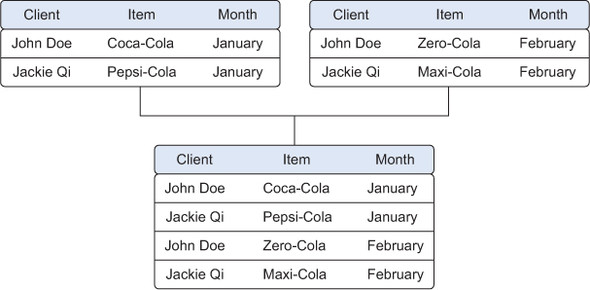
    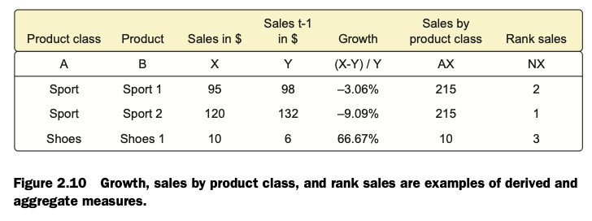
</div>

# <span class="blue-text">Transform</span> Data in a Ready-to-Analysis Shape
- Scale: normalize or standardize numerical features
- Reduce variables: helps to reduce the number of features while retaining key information to avoid over-fitting and slow computation
- Encode: convert categorical variables into numerical format
<div class="columns">
    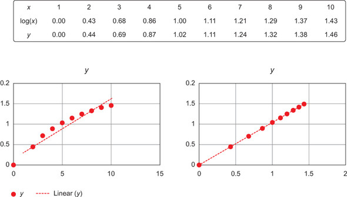
    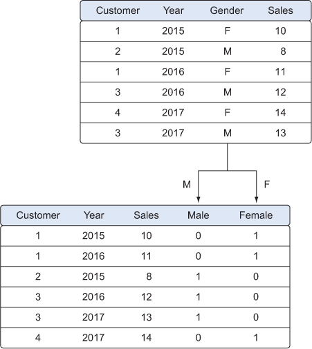
</div>

# #4: Exploratory Data Analysis (EDA)
EDA uses (1) **basic statistics** and (2) **data visualization** to get an overview of the data we have, in order to do (3) **feature acquisition**.
- Know the Data - what information and structure of the data
- Check the Data - any outliers or unusual value
- Correlation between Data - find out important variables.
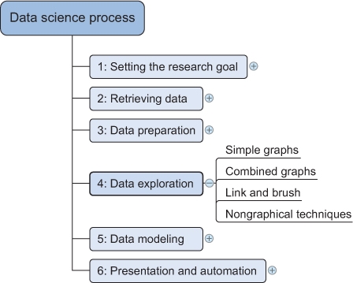

# EDA Techniques
- **Step1**: recognizing the type of each variable so you can apply the right descriptive statistics, cleaning methods, and visualization techniques.
- **Step4**: detect and minimize impact of missing and unexpected values
- **Step6**: feature engineering, where features are transformed or combined to generate new features.
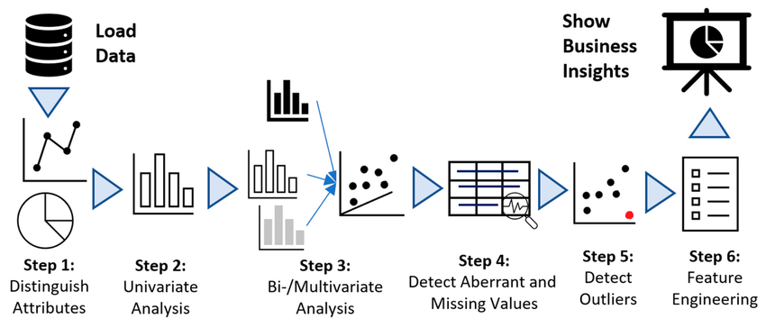

# Visualization Techniques
<div class="columns">
    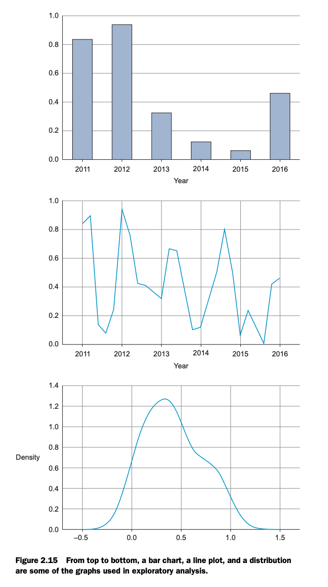
    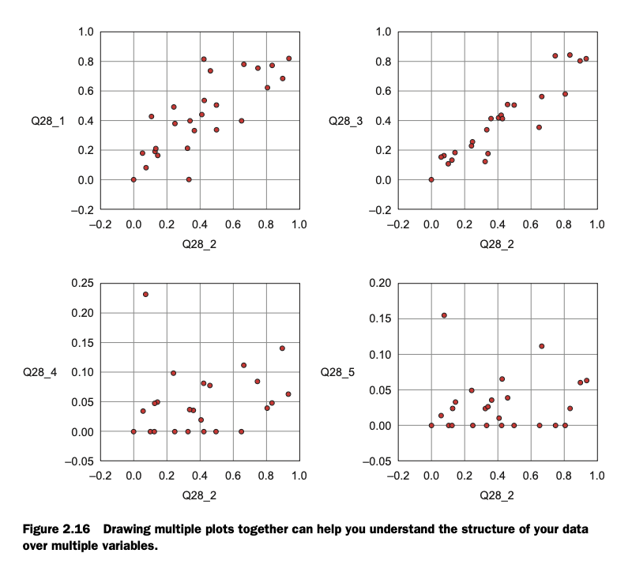
</div>

# #5: Build the Models
- With clean data in place and a good understanding of the content, you’re ready to build models with the goal of making better predictions, classifying objects, or gaining an understanding of the system that you’re modeling.
- The modeling techniques come from machine learning, data mining, neural network or statistics fields
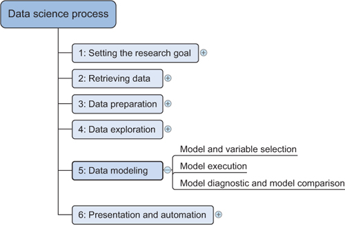

# Model: Simplified Representations of Complex System
- Models are used to understand, predict the behavior of systems.
- In data science, models often use statistical or machine learning to analyze and interpret data.
- Formulate a problem as a function, like estimate the house price y = f(x)
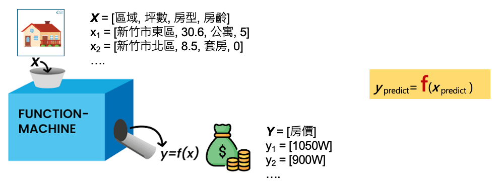


# 5-1: Model and Variable Selection
- Your findings from the exploratory analysis should already give a fair idea of (1) which variables are important and (2) what variables will help you construct a good model. 
- Many modeling techniques are available, and choosing the right model to fit your requirement and consider the model is:
  - Easy to implement and go production
  - Easy to maintain and tunning
  - Easy to explain

# 5-2: Model Execution - Linear Regression Model as an Example
Linear regression is one of the simplest and most widely used statistical methods for modeling the relationship between variables. It assumes a linear relationship between the independent variable (input) and the dependent variable (output), allowing us to make predictions based on new input data.
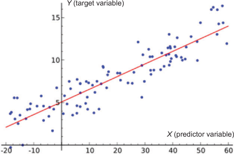
# Python Library for Linear Regression

```python
import numpy as np
from sklearn.linear_model import LinearRegression
from matplotlib import pyplot as plt


# Sample data
X = np.array([[1], [2], [3], [4], [5]])   # feature
y = np.array([2, 4, 5, 4, 5])             # target

# Fit model
model = LinearRegression()
model.fit(X, y)

print("Intercept:", model.intercept_)
print("Slope:", model.coef_)
print(f"Formula is y = {model.coef_} x + {model.intercept_}")
point_x = 2.5
point_y = model.predict([[2.5]]).item()
print(f"Prediction for x = {point_x} is", point_y)

plt.scatter(X, y)
plt.plot(X, model.coef_ * X + model.intercept_, 'b')

plt.scatter(point_x, point_y, color = 'r')
plt.text(point_x + 0.2, point_y, f'predict ({float(point_x):.2f}, {float(point_y):.2f})', fontsize=10, color = 'r')
plt.show()
```

# 5-3: Model Diagnostics and Model Comparison
- We will build several models from which we then choose the best one based on multiple criteria, like mean square error
- **80/20 split** refers to dividing a dataset into two subsets: 80% for training the model and 20% for testing its performance.
$$
\text{MSE} = \frac{1}{n} \sum_{i=1}^{n} \left( \hat{Y}_i - Y_i \right)^2
$$

- model 1 is size = 3 * price
- model 2 is size = 10
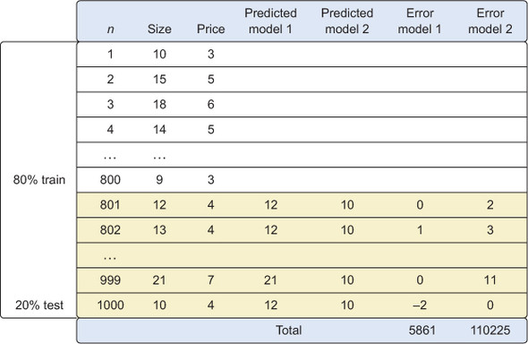

# #6: Presenting findings and building applications on top of them
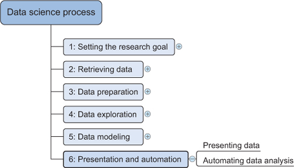

# Summary
- Setting the research goal: Define what, why, and how of project in a project charter.
- Retrieving data: Find and get access to data needed in your project. This data is either found within the company or retrieved from a third party.
- Data preparation: Check and remediate data errors, enrich the data with data from other data sources, and transform it into a suitable format.
- Data exploration: Dive deeper into your data using descriptive statistics and visual techniques.
- Data modeling: Use ML and statistical techniques to achieve project goal.
- Presentation and automation: Present your results to the stakeholders and industrialize your analysis process for repetitive reuse and integration with other tools.

# 學習地圖
>超圖解
資料科學 ✕ 機器學習
實戰探索：使用 Python
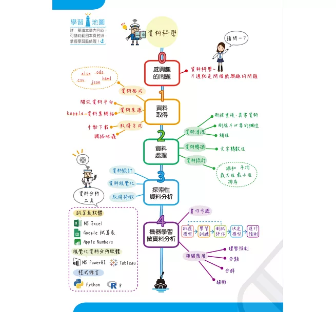

# Review
# 1. Which of the following best describes the data science process?
A. A strictly linear sequence of steps
B. A structured but iterative approach to solving data problems
C. A random trial-and-error approach
D. A process focused only on machine learning

# 2. What is the main purpose of the project charter in Step #1 'Setting the research goal'?
A. To store datasets
B. To get stakeholder authorization
C. To visualize results
D. To clean data

# 3. Evaluating data veracity does NOT include which factor?
A. Data availability
B. Data quality
C. Licensing and authorization
D. Model accuracy

# 4. Which of the following best describes “data cleaning”?
A. Joining multiple datasets
B. Handling missing values and removing duplicates
C. Reducing variables
D. Encoding categorical features

# 5. Which operation combines two datasets based on a common key?
A. Append
B. Join
C. Derive
D. Encode

# 6. Which transformation reduces the number of features while retaining essential information?
A. Scaling
B. Encoding
C. Reducing variables
D. Appending

# 7. The main goal of Exploratory Data Analysis (EDA) is to:
A. Train predictive models
B. Identify patterns, trends, and anomalies
C. Encode categorical variables
D. Reduce computation cost

# 8. Which of the following is an example of a modeling technique?
A. Normalization
B. Data warehouse integration
C. Machine learning
D. Visualization

# 9. In model diagnostics, the 80/20 split refers to:
A. 80% test data, 20% validation data
B. 80% clean data, 20% dirty data
C. 80% training data, 20% testing data
D. 80% categorical, 20% numerical variables

# 10. Which of the following is an example of an external data source?
A. Company log files
B. Excel files of company engineering report
C. Open government data
D. On-premises data warehouse

