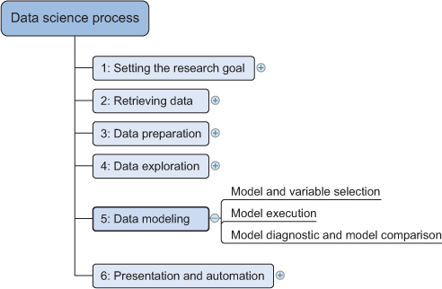
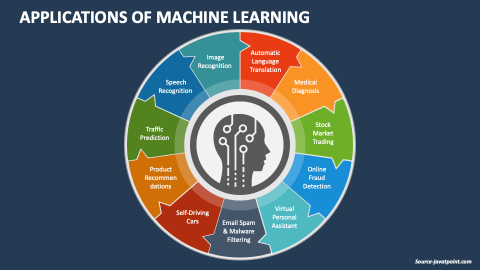
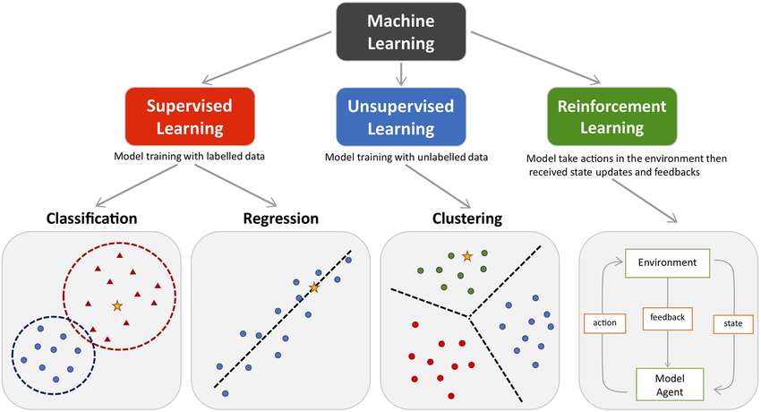
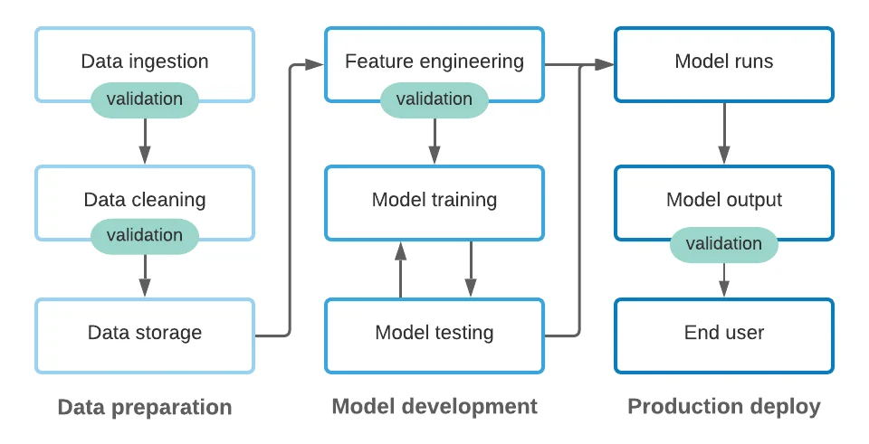
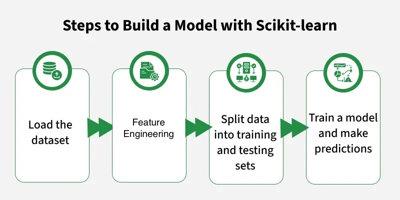

# Machine Learning: a Data Modeling Technique
>Machine learning is a field of study that gives computers the ability to learn without being explicitly programmed

>Machine learning is the process by which a computer can work more accurately as it collects and learns from the more data it is given

# Applications of Machine Learning

# Python Tools Used in Machine Learning: Scikit-learn

# Types of Machine Learning

# ML Modeling Process
Building model is to guess the **target** (response) variable. To do that, it relies on **features** (predictors)— things you already know 
The process includes:
- Feature engineering and model selection
- Training the model
- Model validation
- Applying the trained model

# Feature engineering
>Feature Engineering is the process of transforming raw data into meaningful features that can be better understood and used by machine learning models.
Often you may need to consult an expert or the appropriate literature to come up with meaningful features.

Suppose we want to predict whether it will rain tomorrow (Yes/No) **target**.
* Raw data: 2025-08-19 14:35, Hsinchu, Temperature = 30.2, Humidity = 75%
* After feature engineering:
	•	*month = 8, hour = 14, is_weekend = 0*
	•	*city_Hsinchu = 1, city_Taipei = 0, city_Taichung = 0*
	•	*temperature = 30.2; humidity = 0.75*
👉 These structured features can now be used by a machine learning model.

# Select Model
Scikit-learn provides a various methods for classification, regression, clustering and dimensionality reduction tasks.

# Train Model
- After feature engineering and model selection, the next step is to split data into training sets and testing sets
- Then, train model by training data set. This involves feeding the model with the features and the corresponding target values.

# Validate Model
- Validation is a way to estimate how well the model will perform on unseen data. Not just on the training data.
- Error measure (how wrong the model is) and validation strategies would be designed
  - Error measure method: mean squared error (MSE), or accuracy
    - MSE measures how far off your numeric predictions are.
    -	Accuracy measures how often your categorical predictions are correct.
  - Validation strategies
    - holdout validation (截留驗證法): train once, test once (80% for training and 20% for testing) 
    - k-fold cross-validation(交叉驗證法): train many times on different splits, then average results

# Apply Model
- After validating the model, the final step is to apply it to new, unseen data to make predictions.
- This involves using the trained model to infer the target variable based on the features of the new data.

# Classification
Case study: Recognition of Handwritten Digits

[`recognition_handwritten_digits.ipynb`](file/code/recognition_handwritten_digits.ipynb)

# Clustering
Case study: Iris Flower Dataset
[`kmeans_iris.ipynb`](file/code/kmeans_iris.ipynb)

# Dimensionality Reduction
Case study: PCA on Wine Quality Dataset
[`pca_wine_quality.ipynb`](file/code/pca_wine_quality.ipynb)
