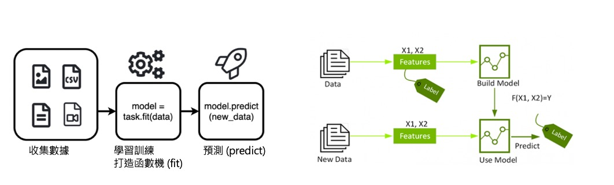
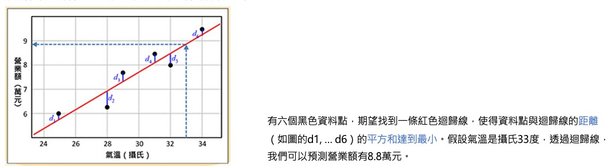
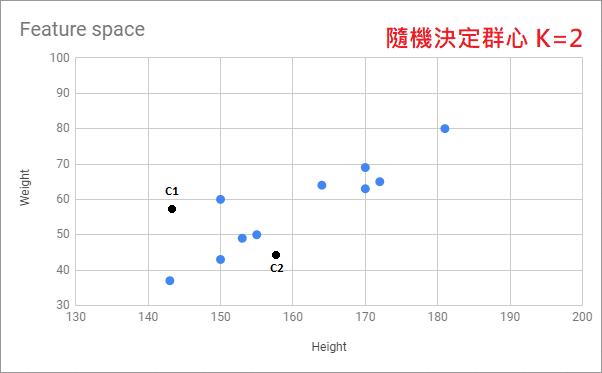
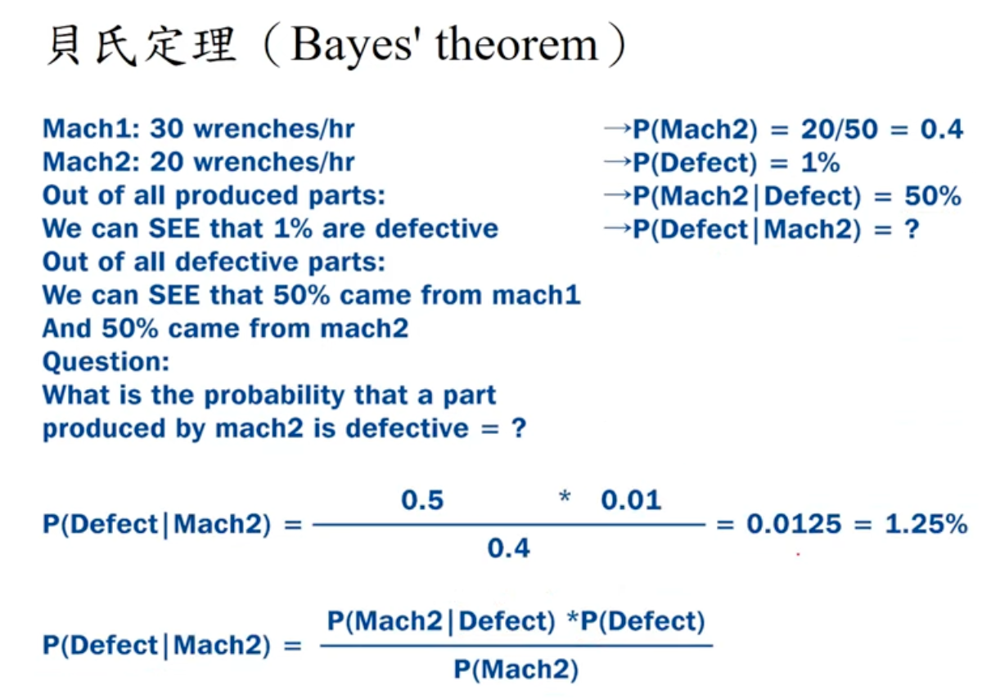
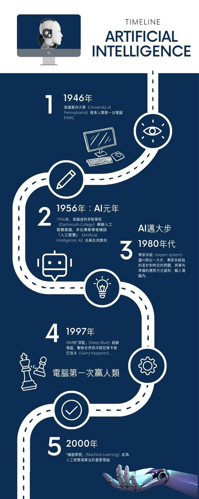
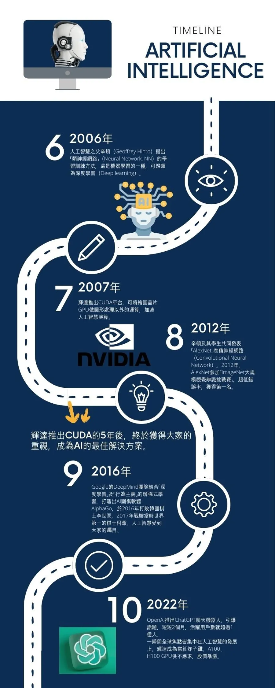

# Machine Learning
### A Data Modeling Technique
>Machine learning is a field of study that gives computers the ability to learn without being explicitly programmed

# AI Development History

- 人工智慧(Artificial Intelligence, AI)可視為一種概念，希望透過軟硬體的結合，讓機器設備能模仿人類的行為，像人一樣執行任務
- 機器學習(Machine Learning, ML)是透過演算法，使用大量資料進行訓練，進而產生模型，這模型可用於針對新資料進行結果預測
- 深度學習(Deep Learning, DL) 仿造人類神經網絡的運作方式，經由人工神經網路交互運算，最後判斷出結果, 是目前AI成長最快的領域，生成式AI便是利用DL來生成文字圖像

# ML vs. DL

機器學習的大部分算法需要人類尋找特徵，而深度學習可以自動生成特徵

# ML Steps

- 特徵(Feature): 用於模型訓練的輸入變數
- 標籤(Label): 模型預測的目標變數
- 訓練集(Training Set): 用於訓練模型的數據集
- 測試集(Test Set): 用於評估模型性能的數據集

# ML Algorithms

# ML Applications

# ML Modeling Process
Building model is to guess the **target / label** (response) variable. To do that, it relies on **features** (predictors)— things you already know 

# MLOPs Workflow
MLOPs (ML Operations) workflow includes:
- Data collection and cleaning
- Feature engineering and model selection
- Model training and validation
- Model deployment and monitoring

# Feature engineering
>Feature Engineering is the process of transforming raw data into meaningful features that can be better understood and used by machine learning models.
Often you may need to consult an expert or the appropriate literature to come up with meaningful features.

Suppose we want to predict whether it will rain tomorrow (Yes/No) **target**.
* Raw data: 2025-08-19 14:35, Hsinchu, Temperature = 30.2, Humidity = 75%
* After feature engineering:
	•	*month = 8, hour = 14, is_weekend = 0*
	•	*city_Hsinchu = 1, city_Taipei = 0, city_Taichung = 0*
	•	*temperature = 30.2; humidity = 0.75*
👉 These structured features can now be used by a machine learning model.

# Select Model
Scikit-learn provides a various methods for classification, regression, clustering and dimensionality reduction tasks.

# Train Model
- After feature engineering and model selection, the next step is to split data into training sets and testing sets
- Then, train model by training data set. This involves feeding the model with the features and the corresponding target values.

# Validate Model
- Validation is a way to estimate how well the model will perform on unseen data. Not just on the training data.
- Error measure (how wrong the model is) and validation strategies would be designed
  - Error measure method: mean squared error (MSE), or accuracy
    - MSE measures how far off your numeric predictions are.
    -	Accuracy measures how often your categorical predictions are correct.
  - Validation strategies
    - holdout validation (截留驗證法): train once, test once (80% for training and 20% for testing) 
    - k-fold cross-validation(交叉驗證法): train many times on different splits, then average results

# Deploy and Monitor Model
- After validating the model, the final step is to apply it to new, unseen data to make predictions.
- This involves using the trained model to infer the target variable based on the features of the new data.

# Practice Python Library to Build ML Models
- Python has a rich ecosystem of libraries for machine learning. One of the most popular is Scikit-learn.
- **Scikit-learn** provides a various methods for regression, classification, clustering and dimensionality reduction tasks.

# Regression Concepts
- 迴歸是一種監督式學習, 把有正確答案的資料給模型來找出規律
- 其中的線性迴歸用於建立兩個變數關係的模型。通常目標是根據輸入變數(features)值來預測輸出變數值(label)。

# Linear Regression Case Study

Global Temperature Change Prediction
[`regression_temperature.ipynb`](file/code/regression_temperature.ipynb)
 
糖尿病病程預測
[`regression_diabetes.ipynb`](file/code/regression_diabetes.ipynb)

# Clustering Concepts
- 分群(Clustering)是一種非監督式學習. 非監督式學習演算法只基於輸入資料找出模式，無法正確找出結果。待分析的資料集中沒有任何的答案(label)，只有資料本身
- 比如，一組身高和體重的資料集，但不知道這組資料中，那一筆資料是男生，那一筆是女生。但希望用這組資料分出男生女生，這種時候就是用非監督式學習。
- 分群用於將數據點分組，使得同一組內的數據點彼此相似，而不同組之間的數據點則相異。
- K-Means就是透過這個概念將資料做分群，顧名思義就是將資料分成一群一群。常被用在客戶分群、文件分群、商品推薦

# K-Means Algorithm Steps
1. 首先設定要分成多少群：K
2. 然後在特徵空間中隨機設定K個群心。
3. 計算每一個資料點到K個群心的距離 (基本上使用 L2/歐幾里得距離，但也是可以換成別的。)
4. 將資料點分給距離最近的那個群心。
5. 在所有資料點都分配完畢後，每一群再用剛剛分配到的資料點算平均(means)來更新群心。
6. 最後不斷重複3–5 的動作，直到收斂 ( 每次更新後群心都已經不太會變動 ) 後結束。

# K-Means Case Study

Randomly generated dataset
[`kmeans_dummy.ipynb`](file/code/kmeans_dummy.ipynb)

Case study: Iris Flower Dataset
[`kmeans_iris.ipynb`](file/code/kmeans_iris.ipynb)

# Classification Concepts
- 分類(Classification)是一種監督式學習任務，旨在將一個未知類別的物件依據其特徵(features), 分配到預定義的類別中
- 分類模型學習從訓練數據中識別特徵與類別之間的關係，然後使用這些關係來預測新數據的類別。
- 常見的分類算法包括 Naive Bayes (使用概率論，貝葉斯定理)、決策樹(Decision Trees)、支持向量機(Support Vector Machines, SVM)等。
- Naive Bayes 是一種基於Bayes’ Theorem的機率分類器，用來預測樣本屬於某個類別的機率。

# Bayes' Theorem
- mach1: 30 wrenches/hr # 機器一的生產速度
- mach2: 20 wrenches/hr # 機器二的生產速度
- 整體產品的不良率: 1%, 其中
  - 50%來自於 mach1
  - 50%來自於 mach2
- Q: mach2生產出不良品的機率為何? **P(defect|mach2)**

# Practice Bayes' Theorem

# Naive Bayes Classifier Steps

# Classification Case Study
Case study: Recognition of Handwritten Digits

[`recognition_handwritten_digits.ipynb`](file/code/recognition_handwritten_digits.ipynb)

# Summary
- Machine learning is a technique that allows computers to learn from data and make predictions or decisions without being explicitly programmed.
- The machine learning process involves feature engineering, model selection, training, validation, and application.
- Common types of machine learning include supervised learning (classification and regression), unsupervised learning (clustering and dimensionality reduction).
- Python's Scikit-learn library provides a wide range of tools for building and deploying machine learning models.

# Homework
HW4 - BMI prediction using regression model

# Review
# 1. What is the main goal of machine learning?
A. To explicitly program computers to perform specific tasks
B. To enable computers to learn from data and make predictions or decisions
C. To store large amounts of data efficiently
D. To visualize data in a more understandable way
# 2. Which of the following is NOT a step in the machine learning modeling process?
A. Feature engineering
B. Model selection
C. Data encryption
D. Model validation
# 3. In supervised learning, what is the difference between classification and regression?
A. Classification predicts continuous values, while regression predicts categorical labels
B. Classification predicts categorical labels, while regression predicts continuous values
C. Classification is used for clustering, while regression is used for dimensionality reduction
D. Classification and regression are the same
# 4. Which Python library is commonly used for building machine learning models?
A. NumPy
B. Pandas
C. Scikit-learn
D. Matplotlib
# 5. In model validation, what is the purpose of using k-fold cross-validation?
A. To train the model on the entire dataset without splitting
B. To evaluate the model's performance on different subsets of the data and reduce overfitting
C. To visualize the model's predictions
D. To encrypt the data for security purposes
# 6. Which of the following is an example of a regression problem?
A. Predicting whether an email is spam or not
B. Classifying images of handwritten digits
C. Predicting the price of a house based on its features
D. Grouping customers based on their purchasing behavior
# 7. What is the main purpose of feature engineering in machine learning?
A. To transform raw data into meaningful features that can be used by machine learning models
B. To encrypt the data for security purposes
C. To visualize the data in a more understandable way
D. To store large amounts of data efficiently
# 8. In the context of machine learning, what does the term "target variable" refer to?
A. The features used to make predictions
B. The variable that the model is trying to predict
C. The algorithm used to train the model
D. The validation strategy used to evaluate the model
# 9. Which of the following is NOT a common type of machine learning?
A. Supervised learning
B. Unsupervised learning
C. Reinforcement learning
D. Data encryption
# 10. What is the main advantage of using machine learning over traditional programming methods?
A. Machine learning can handle large amounts of data more efficiently
B. Machine learning can adapt and improve its performance as it learns from new data
C. Machine learning is easier to implement than traditional programming
D. Machine learning does not require any data to function

# Supplement
# 廣義的 AI 人工智慧

- 人工智慧是一個目標，一種概念，不全然是具體的執行方法。
- 人類期待電腦或機器能夠透過程式模仿人類的感知、理解與行動，進而完成只有人類智慧才能達成的事情。
- 自然語言處理、電腦視覺、語音辨識
- 機器人、專家系統、博弈系統

# 機器學習

透過演算法，使用大量資料進行訓練，訓練完成後會產生模型。未來當有新的資料，我們可以使用訓練產生的模型進行預測。
- 垃圾郵件分類
- 心臟病風險評估
- YouTube / Netflix 推薦你喜歡的內容
- 網購系統推薦商品給你

# 深度學習

仿造人類大腦學習的方式，經由類神經網路，一層一層下去交互運算，最後判斷出結果，如同讓AI模仿小孩一樣去學習認貓咪
- 聊天機器人（自然語言生成）
- 文字生成圖像
- 人臉辨識 / 影像分類
- 語音辨識與合成
- 自駕車
- 醫療影像分析
- 自動翻譯

# 生成式AI

讓AI成為會創作新內容的數位畫家和數位作家
  - 學生專屬家教
  - 文章總結，整理報告及重點分析
  - 自動生成簡報大綱及內容
  - 製作社群貼文
  - 智慧客服
  - 虛擬直播主

# AI 是從哪裡蹦出來的？

# 

# 

# 

# Dimensionality Reduction Concepts
- 維度縮減(Dimensionality Reduction)是一種非監督式學習技術，用於將高維數據投影到較低維的空間，同時保留數據的主要特徵和結構。
- 想像一個擁有數百甚至上千個特徵（欄位）的資料集。這樣的情況可能會帶來計算成本高, 難以視覺化, 特徵冗餘等問題。
- 主成分分析(Principal Component Analysis, PCA)是最常用的維度縮減技術之一。PCA通過線性變換將數據投影到新的坐標系中，這些坐標系由數據的主要變異方向（主成分）定義。

# Dimensionality Reduction Illustration

# Dimensionality Reduction
Case study: PCA on Wine Quality Dataset
[`pca_wine_quality.ipynb`](file/code/pca_wine_quality.ipynb)

