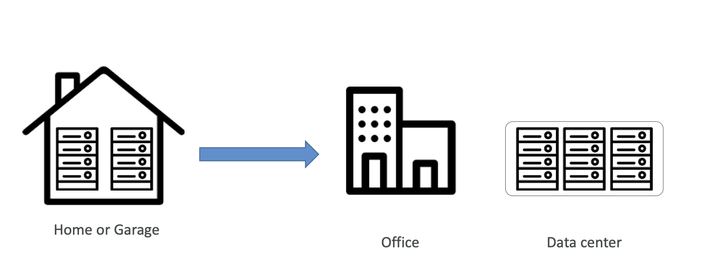

# Cloud Computing

# Traditional IT Infrastructure

Problems with traditional IT approach
- Pay for the data center
- Pay for power, cooling, maintenance
- Add and replace hardware takes time
- Scaling is limited
- Hire 24/7 team to monitor the infrastructure
- How to deal with disasters? (earthquake, power shutdown, fire…)

# Can We Externalize All of This?

# What is Cloud Computing

# Introduction of Cloud Computing
- Cloud computing is the on-demand delivery of compute power, database storage, applications, and other IT resources
- Through a cloud services platform with pay-as-you-go pricing
- You can access as many resources as you need, almost instantly
- Simple way to access servers, storage, databases and a set of application services
- Many legacy and traditional data center resources are on-premises. There has been a shift to migrate IT assets to the cloud in recent years or creating hybrid environments that use a mix of cloud and on-premises solutions. 
- Large clouds often have functions distributed over <u>multiple locations (data center)</u>.

# Major Cloud Service Providers
Amazon (AWS, Amazon Web Services): Cloud computing is the on-demand delivery of IT resources over the Internet with pay-as-you-go pricing. Instead of buying, owning, and maintaining physical data centers and servers, you can access technology services, such as computing power, storage, and databases, on an as-needed basis from AWS. 
Microsoft (Azure): 雲端運算可透過網際網路來傳遞伺服器、儲存體、資料庫、網路、軟體等運算服務，以加快創新的速度、確保資源彈性，並實現規模經濟。您只需支付所使用的雲端服務費用，更有效率地執行基礎結構，並隨著業務需求變更來進行調整。 
Google (GCP, Google Cloud Platform): 雲端運算架構能根據使用者需求，透過網路以服務的形式提供運算資源，例如儲存空間和基礎架構。這樣個人和企業就不必自行管理實體資源，而且用多少付多少。

# Deployment Models
- Public cloud
- Private cloud (on-premises)
- Community cloud (government, education, back)
- Hybrid cloud

# Deployment Models Comparison
- Private Cloud
  - Cloud services used by a single organization, not exposed to the public
  - Complete control and fully meet specific business needs
  - Security for sensitive applications
- Public Cloud
  - Cloud resources owned and operated by a third-party cloud service provider
  - Six advantages of Cloud Computing
- Hybrid Cloud
  - Keep some servers on premises and extend some capabilities to the Cloud
  - Control over sensitive assets in your private infrastructure
  - Flexibility and cost-effectiveness of the public cloud

# Characteristics of Cloud Computing
- On-demand self service: users can provision resources and use them without human interaction from the service provider
- Broad network access: resources available over the internet
- Multi-tenancy and resource pooling: multiple customers can share the same infrastructure and applications with security and privacy
- Rapid elasticity and scalability:
  - Automatically and quickly acquire and dispose resources when needed
  - Quickly and easily scale based on demand
- Measured service: Usage is measured, users pay correctly for what they have used

# Advantages of Cloud Computing
- Trade capital expense (CAPEX) for operational expense (OPEX)
- Pay On-Demand: don’t own hardware
- Reduced Total Cost of Ownership (TCO) & Operational Expense (OPEX)
- Benefit from massive economies of scale
- Prices are reduced as service provider is more efficient due to large scale
- Stop guessing capacity
- Scale based on actual measured usage
- Increase speed and agility
- Stop spending money running and maintaining data centers
- Go global in minutes: leverage the service providers' global infrastructure

# Problems Solved by Cloud Computing
- Flexibility: change resource types when needed
- Cost-Effectiveness: pay as you go, for what you use
- Scalability: accommodate larger loads by making hardware stronger or adding additional nodes
- Elasticity: ability to scale out and scale-in when needed
- High-availability and fault-tolerance: build across data centers
- Agility: rapidly develop, test and launch software applications

# Service Models
  
- IaaS (Infrastructure as a service)
- PaaS (Platform as a service)  MySQL, Kubernetes, Google App Engine
- SaaS (Software as a service)

# Service Models Comparison
- Infrastructure as a Service (IaaS)
  - Provide building blocks for cloud IT
  - Provides networking, computers, data storage space
  - Highest level of flexibility
  - Easy parallel with traditional on-premises IT
- Platform as a Service (PaaS)
  - Removes the need for your organization to manage the underlying infrastructure
  - Focus on the deployment and management of your applications
- Software as a Service (SaaS)
  - Completed product that is run and managed by the service provider

# Examples of Service Models
- Infrastructure as a Service:
  - Amazon EC2 (on AWS)
  - GCP, Azure, Cloud storage
- Platform as a Service:
  - AWS Elastic Beanstalk
  - MySQL, Kubernetes, Google App Engine
- Software as a Service:
  - AWS Rekognition for Machine Learning
  - Gmail, Dropbox, Zoom

# Shared Responsibility

# Pricing of Cloud
AWS has 3 pricing fundamentals, following the pay-as-you-go pricing model
• Compute: pay for compute time
• Storage: pay for data stored in the cloud
• Data: transfer OUT of the cloud; data transfer IN is free

# Recap Cloud Computing

# AWS Cloud Certificates
[AWS certification paths (PDF)](file/doc/AWS_certification_paths.pdf)

# Are Certificates Worth?
- [雲端證照真的會帶領你走向夢想中的工作嗎? AWS 與 Azure 證照的解析](https://medium.com/@cloudarchitectec/職場-雲端證照真的會為職場加分嗎-aws-與-azure-證照比較-6fac635933b8)
>最後，雖然我個人覺得雲端證照完全對於職場之路幫助不大（唯一的助益可能是考過證照之後可以在 LinkedIn上炫耀一天，會有很多人恭喜你）但我覺得對於雲端服務有興趣，但又不知道從何學起的人來說，由證照入手會是我自己最推薦的方法。因為網路上有很多系統性的學習資源，比起你東學一點西學一點最後不知道自己在學什麼或自己需要學什麼，按照證照的學習規劃來學習還是一條直接且高效的路線

- [雲端證照考不考](https://medium.com/@junwang-ajourneyofman/雲端證照考不考-9a61fa304348)
>總結來說，我覺得都是要看自己的階段，與現在的目標。證照都只是一個輔助和加分的選項。它不等於全部，但有它會增加很多機會和能見度。對某些人來說，這也會是一個系統性整理技術認知的方式。

# Connect Together ?!

7月21日，微軟發出聲明指出，根據統計，全球總共有850萬台Windows系統裝置受到影響，而這些設備總計不到Windows設備的1%，公司正日以繼夜地協助客戶恢復正常運作。
然而，微軟口中的「僅1%設備受到影響」，卻造成全球航空、銀行、醫療、零售業大災難。在微軟系統癱瘓的數小時之中，全球超過21000個航班延誤，轉機旅客因為無法順利搭上飛機，後面的旅遊行程大多報廢，旅行產業到現在都還深受影響，旅客不斷抱怨。有些醫院因此改為人工掛號，影響看診，更有些醫院的手術被迫延遲進行。

# Other EVENTS
[2025/10/29] 微軟服務中斷影響Azure、Office 365、Xbox、Minecraft等多個平台
[2025/10/20] AWS US-EAST-1 美東機房大當機，眾多重量級服務網站掛點
[2025/06/12] 谷歌Cloud 全球宕機超3 小時，官方確認API管理失誤導致
[2024/07/18] 微軟美國服務無預警大當機，導致M365在內的眾多Azure雲端服務中斷
[2024/05/14] Google Cloud出包！誤刪這公司雲端資料和備份 50萬用戶退休金「消失」
[2023/06/13] 亞馬遜AWS雲端服務當機 紐約大都會運輸署、《波士頓環球報》受害
[2023/01/25] Outlook、Teams全球大當機！上千人受影響　微軟證實：調查中

# Summary
- Cloud computing provides on-demand delivery of IT resources over the internet with pay-as-you-go pricing.
- Deployment models include public, private, community, and hybrid clouds.
- Service models are IaaS, PaaS, and SaaS, each offering different levels of control and management.
- Major cloud providers are AWS, Microsoft Azure, and Google Cloud Platform.
- Key characteristics include on-demand self-service, broad network access, multi-tenancy, rapid elasticity, and measured service.
- AWS pricing is based on compute time, storage, and data transfer.
- The shared responsibility model divides security responsibilities between the provider and the customer.

# Review Questions
1. What are the main deployment models of cloud computing? Briefly describe each.
2. Compare and contrast IaaS, PaaS, and SaaS service models in cloud computing.
3. Name three major cloud service providers and mention one key feature of each.
4. List and explain at least three key characteristics of cloud computing.

