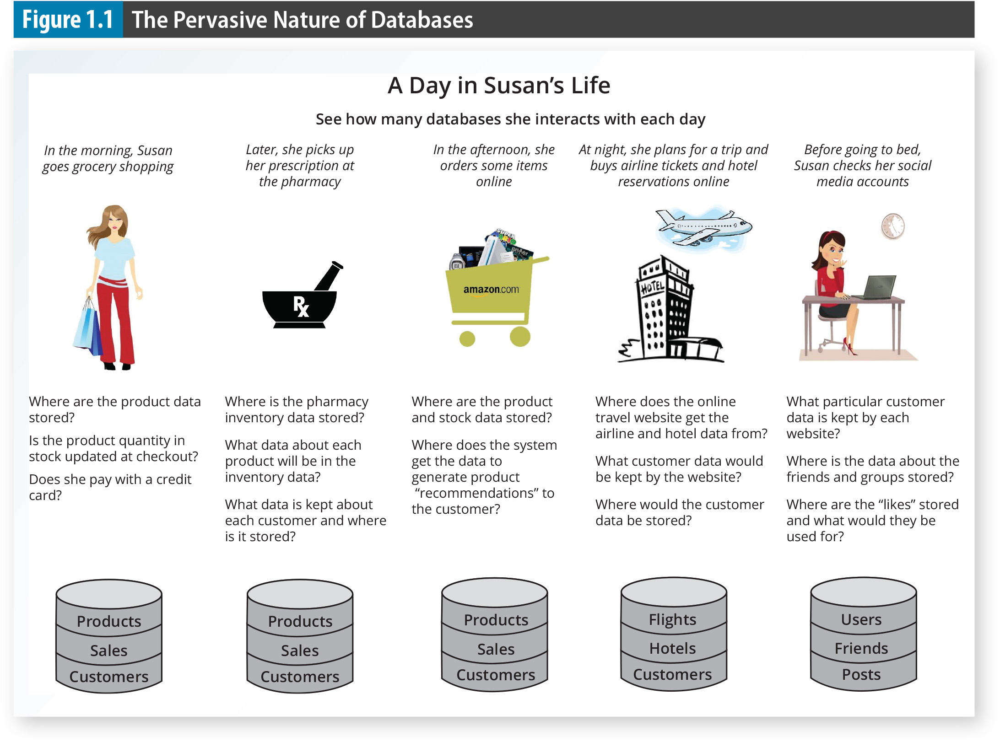
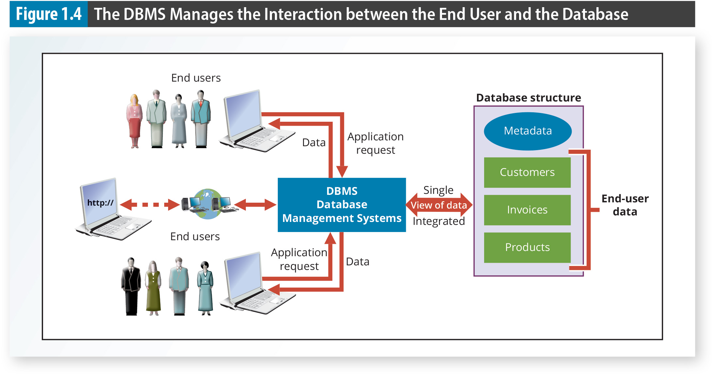
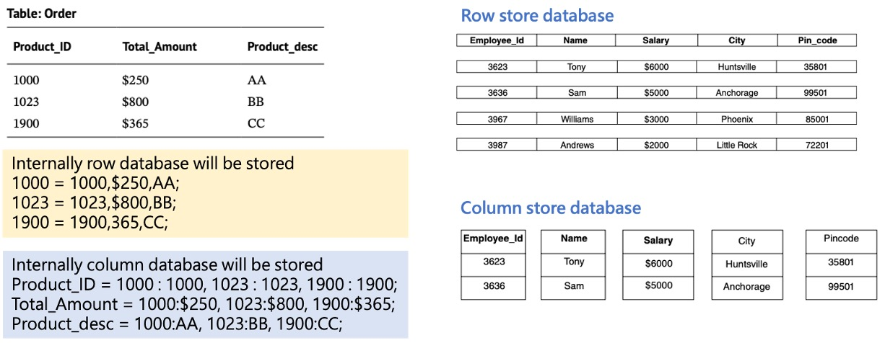

# Database
- Databases evolved from the need to manage **large amounts** of data in an **organized and efficient** manner
- Databases is everywhere


# Introducing the Database
- A **database** is a collection of related data.
  - represent a **mini-world** to reflect some aspect of the real world
  - **logically coherent** collection of data with some inherent meaning
  - is designed, built, and populated with data for **a specific purpose**
- A **database management system (DBMS)** is a collection of programs that manages the database **structure** and **controls access** to the data stored in the database. Here, the database refers to a **shared, integrated** computer structure.
- Examples of DBMS: MySQL, Microsoft SQL Server, Oracle Database, MongoDB, Cassandra, Neo4j, ...

# Role and Advantages of DBMS
- DBMS presents the end user with a single, integrated view of the data in the database
- DBMS advantages:
  - Improved data sharing
  - Improved data security
  - Better data integration
  - Minimized data inconsistency
  - Improved data access


# Types of DBMS

- by # of users: single-user, multiple-user 
- by location: centralized, distributed, cloud
- by time sensitive: online transaction processing (OLTP), online analytical processing (OLAP)
- by data characteristics: SQL store structured data, NoSQL store unstructured and semi-structured data

# SQL Database
- SQL database (relational database) is managed by Relational Database Management Systems (RDBMS) that use Structured Query Language (SQL) to manage data.
- SQL database stores data in a structured, table-based (rows and columns) format.
- Structured Query Language (SQL): a standard programming language used to interact with the database to operate databases, manipulate data and query data.
- Examples: MySQL, PostgreSQL, SQLite, Microsoft SQL Server, Oracle Database

[](https://youtu.be/Ppod0sNKxSY?si=X0ZDdrB3s0GzlBjK)

[](https://youtu.be/7yYbbKyyHvw?si=Y3vrhXjLHS4FGtkN)

# SQL Language
[](https://youtu.be/emBDEs_zZVs?si=0ivL51vtqvpBWZOA)

```sql
-- 查詢成績介於 80 和 90 分
SELECT 姓名, 班級, 成績 
FROM student 
WHERE 成績 >= 80 AND 成績 <90;

-- 計算成績欄的平均值、加總值、最大值、最小值、計數
SELECT AVG(成績), SUM(成績), MAX(成績), MIN(成績), COUNT(成績)
FROM students; 


-- 插入資料到社團表格
INSERT INTO clubs (社團編號, 社團名稱)
VALUES (101, '吉他社'), (102, '籃球社'), (103, '美術社'), (104, NULL);
```

# Embedded SQL
- Embedded SQL are SQL statements contained within an application programming language like Python, C, COBOL
```python
# install package mysql-connector-python from PyPI
import mysql.connector
conn = mysql.connector.connect(
    host = '127.0.0.1',
    user = 'dbms_demo',
    password = '12345',
    database= 'EPPS_SALECO')
cursor = conn.cursor()
query = '''SELECT P_CODE, P_DESCRIPT FROM PRODUCT;'''
cursor.execute(query)
results = cursor.fetchall()
for result in results:
    print(result)
```
# NoSQL Database
- NoSQL (Not Only SQL) databases are a type of database management system designed to handle large volumes of unstructured or semi-structured data.
- NoSQL overcome big data’s scalability and performance issues, which traditional databases were not designed to address.

# NoSQL DB Key Features
- **Schema-less**: NoSQL databases usually do not require a predefined and fixed schema.
- **High scalability**: most NoSQL systems are designed for easy horizontal scaling across many servers
- **High performance**: NoSQL can handle high read/write throughput with very low latency due to distributed architecture and denormalized data models.
- **Support for unstructured or semi-structured Data**:
  - Documents
  - Key-value pairs
  - Wide-column data
  - Graph

# Schema and Schemaless
- Schema-based databases (relational database)
  - Store data in a predefined structure (or schema), including tables, fields and their formats, indexes, and relationships between tables.
  - Any data that doesn’t map to the schema can not be stored in the database. 
  - Great efforts to adjust schema after it’s implemented
- Schemaless databases
  - no predefined schema the data must conform to before it’s added to the database.
  
# SQL DB vs NoSQL DB
|SQL DB|NoSQL DB|
|---|---|
|Structured data with a rigid schema|Structured, Unstructured, Semi- Structured data with a flexible schema.|
|Storage in rows and columns|Data are stored in Key/Value pairs database, Columnar database, Document database, Graph Database.|
|Scale up|Scale out|
|Oracle, mySQL|MongoDB, Cassandra|
|SQL language|Solution-specific method|

# Compare SQL and NoSQL Databases
[](https://youtu.be/YgNvOFSuSG4?si=o_PxgAHw92kKW4TO)

# Types of NoSQL Technologies
- Key-value store database
- Column-oriented (column-based, column-store) database
- Document database
- Graph database


# Key-Value Store Database
- Key-value store database is a type of NoSQL database that uses a simple key-value pairs to store data.
- Each item in the database is stored as a key (unique identifier) and its associated value (data).
- Examples: Redis


# Redis: In-Memory Key-Value Store
- Redis is an open-source, in-memory key-value store database that is designed for high performance and low latency.
- Redis stores data in memory, allowing for extremely fast read and write operations.
- Common use cases: caching, session management, real-time analytics

[](https://youtu.be/HNDtcXVo5ow?si=aoxCPfPPVHmNf8m3)

[](https://youtu.be/kUmrYQO51uA?si=HKekgoUTOlSx5I90)

# Column-store Database
- A column-oriented database stores the data as columns in data store
- A row-oriented database stores the data as row in data store
- Row-oriented or column-oriented, depends on the data retrieval needs. 
  - OLTP (online transaction processing) data retrieves less number of rows and more columns, so the row-oriented database is suitable. 
  - OLAP (online analytical processing) retrieves fewer columns and more rows, so the column-oriented database is suitable.
- Examples: Cassandra

# Illustrate Column-store Database


# Column-Store Storing Method
[](https://youtu.be/p18s8Ckn5H4?si=ZExQWHe-hTFbYAXa)

# Document Database
- A document database is a type of NoSQL database that stores data in the form of documents
- The entire document will be treated as a single, complete unit.
- Documents are typically stored in formats like JSON, XML
- Examples: MongoDB


# MongoDB: Document-Oriented Database


# Illustrate MongoDB
[](https://youtu.be/-bt_y4Loofg?si=7XdAtAV3emsl8UWD)

# Graph Database
- A graph database is a type of NoSQL database that uses graph structures to represent and store data.
- Graph databases are designed to handle highly interconnected data and complex relationships between data points.
- Examples: Neo4j

# Neo4j: Graph Database


# Illustrate Graph Database
[](https://youtu.be/wO5AI1oDGjQ?si=0Ey3-qk1LR7qziKr)

[](https://youtu.be/VPDmk68DcJw?si=JqYHhlDy0PiiBtaJ)

# Summary
- A database is a collection of related data that is organized and managed by a database management system (DBMS).
- DBMS provides advantages like improved data sharing, security, integration, and access.
- SQL databases are structured and use SQL language, while NoSQL databases are schema-less and handle unstructured data.
- NoSQL databases include key-value stores (Redis), column-oriented databases (Cassandra), document databases (MongoDB), and graph databases (Neo4j), each with its own strengths and use cases.
[](https://youtube.com/shorts/8QK_RNLFfZM?si=_nXaHGl9X_CbC4JH)

# Review Questions
# Which among the following databases is not a NoSQL database?
A MongoDB
B SQL Server
C Cassandra
D None of the above

# NoSQL databases are used mainly for handling large volumes of ________ data.
A unstructured
B structured
C semi-structured
D All of the above

# Which of the following is a column store database?
A Cassandra
B Oracle
C MongoDB
D Redis

# Which of the following is a NoSQL database type?
A Key-value
B Document
C Graph
D All of the above

# The simplest of all the databases is ________.
A key-value store database
B column-store database
C document-oriented database
D graph-oriented database

# Many of the NoSQL databases support auto ______ for high availability.
A scaling
B partition
C replication
D backup 
# A ________ database stores the entities also known as nodes and the relationships between them.
A key-value store
B column-store
C document-oriented
D graph-oriented

# Backup
# How do NoSQL databases work
[](https://youtu.be/0buKQHokLK8?si=7jI2FSbxgcfJVBmG)