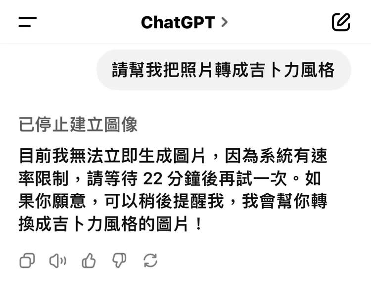
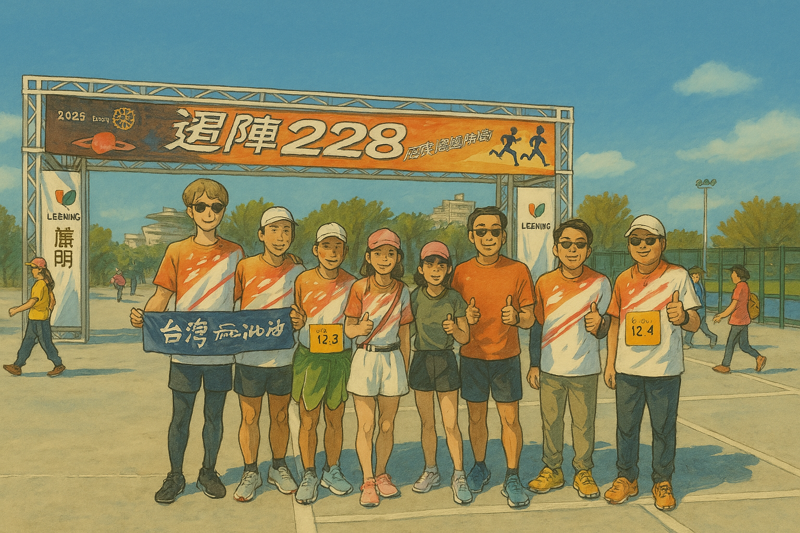
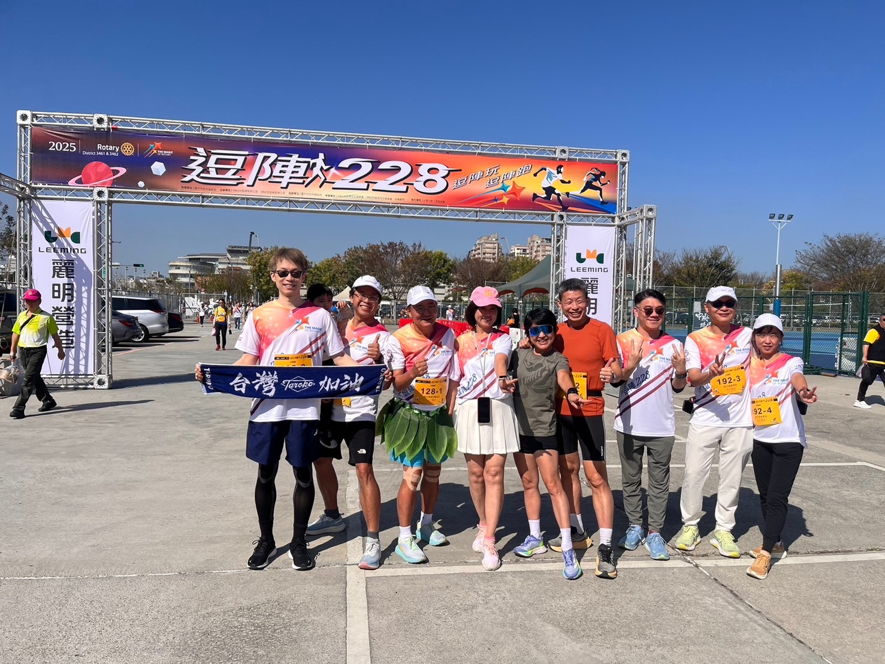
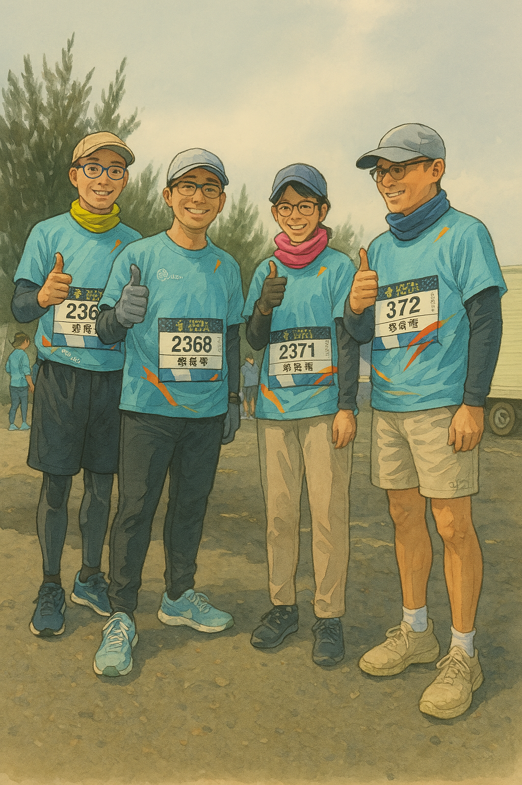

# AI 新世紀 — 生活中正在改變世界的力量
**從想像到日常，我們正走進AI時代**  
林志偉 Jacky | 新竹馬拉松扶輪社 | 2025-04-12

# 林志偉 (Jacky Lin)

- #### 現職
  - 陽明交大 / 電子與光子學士後學程 助理教授
  - 勞動部半導體與重點科技產業人才發展基地 講師
- #### 學歷: 交大資訊管理博士
- #### 經歷: 台積電資訊科技(IT)
- #### 專長: 資料工程、程式設計、資料庫管理
- #### Email: jacky.jw.lin@nycu.edu.tw

# 我們得再跑快一些，否則凸台上不會有'人'了
全球首場「人形機器人」半馬賽　413北京開跑
https://youtu.be/xoYmATyB-Co?si=FkamaKgE9Wx-ntMW
https://youtu.be/jeLMDqq6E-0?si=wCaYqALFp_ujEw19
https://www.facebook.com/share/v/1A84Q7ZgV3/

# AI 新世紀 — 開場
- 歡迎大家！
- 今天用了ChatGPT沒？
- 你有被 AI 驚豔過嗎？今天我們來聊聊生活中的 AI

# AI瘋吉卜力

    
    

# ChatGPT 生成吉卜力圖像掀熱潮 
## 執行長：團隊需要睡眠
（中央社華盛頓30日綜合外電報導）全球掀起一股ChatGPT生成吉卜力風格圖片的熱潮，OpenAI執行長今天開玩笑說，請網友冷靜、必須停止下令生成AI圖片，因為他的團隊需要睡眠，且幾乎導致辦公室的主機幾乎熱到要熔化了。

    

# 除了吉卜力風, 還有別的'瘋'

    
    
    
    

# 我們社的吉卜力 - 228 路跑

    
    

# 我們社的吉卜力 - 龍鳳漁港路跑

    
    

# 時下流行的 ChatGPT
- 就像一位會思考的「數位助理」，可以跟我們對話，回答我們的問題
- 也是個會聊天的百科全書，24小時不打烊，陪我們一起玩，一起工作
  - 寫祝賀詞、文章、報告
  - 檢查作文、翻譯
  - 規劃旅遊、提出創意

# 2024 AI 工具熱門清單

- 聊天機器人
- 創作工具

# ChatGPT == AI ?

# 廣義的 AI 人工智慧

人工智慧可視為一種概念,透過程式模仿人類的感知、理解與行動。
- 自然語言處理
- 影像處理
- 語音處理
- 專家系統
- 模式識別
- 機器人

# 機器學習

透過演算法，使用大量資料進行訓練，訓練完成後會產生模型。未來當有新的資料，我們可以使用訓練產生的模型進行預測。
- 垃圾郵件分類
- 心臟病風險評估
- YouTube / Netflix 推薦你喜歡的內容
- 網購系統推薦商品給你

# 深度學習

仿造人類大腦學習的方式，經由類神經網路，一層一層下去交互運算，最後判斷出結果，如同讓AI模仿小孩一樣去學習認貓咪
- 聊天機器人（自然語言生成）
- 文字生成圖像
- 人臉辨識 / 影像分類
- 語音辨識與合成
- 自駕車
- 醫療影像分析
- 自動翻譯

# 生成式AI

讓AI成為會創作新內容的數位畫家和數位作家
  - 協助老師客製化教材及出考卷
  - 學生專屬家教
  - 文章總結，整理報告及重點分析
  - 自動生成簡報大綱及內容
  - 製作社群貼文
  - 智慧客服
  - 虛擬直播主

# AI 是從哪裡蹦出來的？

# 

# 全世界的資料以年均 23% 的速度成長

# 資料量的意義

當訓練的資料量大到某一個程度後，預測的精準度會有一個大幅度的跳升

# 電腦算力每三年提升一倍

# 電腦算力也越來越便宜

# 除了聊天機器人外，AI 與我何干?

# AI 在農業上的應用
清華大學資工系教授黃能富讓沒有經驗的人也能做對的事
[辨識聲音的AI敲擊棒，讓AI透過燈號告訴農民鳳梨甜不甜](https://youtu.be/oqX4PvF1VnM?si=QZWT4AF5z7uOyRWx)(1:00)

# AI 在服裝上的應用
[布會感應、偵測、回饋, Hexoskin 智慧運動衣](https://youtu.be/U503H_lEO8Q?si=n0UQ_lGQh1D_LYqe)

# AI 在汽車上的應用
[特斯拉無人計程車Cybercab](https://youtu.be/W2jaD74tr4A)(0:22)
[FSD(自動駕駛)的原理概要](https://youtu.be/bjvocAlcvE4?si=_PdovpJ6Pwv2Mdwh)(0:55)

# AI 在建築上的應用
[在荷蘭有一座相當特殊的橋樑，它拋棄傳統的水泥，而是以3D列印的方式，以三個月的時間列印出一座貨真價實的橋樑](https://youtu.be/1BfrxRNc0qY?si=r3HDF-cdrXRDn9lE)

# AI 好棒棒！100% 完美嗎？

# AI 的優點
- 降低工作負載 (例如：ChatGPT 協助撰寫文件、回覆郵件)
- 提升個人創意 (例如：提供靈感，潤飾語句，產生程式碼)
- 獲取即時知識（例如：AI搜尋、文章總結，語音助理）
- 管理個人健康（例如：智慧手環監測健康狀態並提供建議）

# AI 的挑戰
- 假訊息: [AI也被認知作戰? 傳俄羅斯成立秘密部門，訓練ChatGPT產出親俄內容](https://www.ftvnews.com.tw/news/detail/2025310W0574)
- 工作變動與失業風險: 直接讓AI 幫忙寫程式，但… (https://youtu.be/On9xg7wbUT0?si=bJU_1g6lDW8Mlslh)
- 隱私，倫理與侵權：平等存取與演算偏見 (https://youtu.be/tJQSyzBUAew)(0:40)

# 下一個關注焦點 - AI 代理人

    
    

# 另一個產業重點 - 人形機器人
[輝達家事AI機器人精準完成指令](
https://youtu.be/-kUuWqFkZeA?si=LeJLxe41A4Uiy-4Z)

[AI技術再進化！家事機器人走進生活](https://youtu.be/Kd2X1hd1UwI?si=caQQrSiQm86ElTqv)

# 面對 AI 新世紀，我們可以？
- 📘 多了解 AI、嘗試使用 AI 工具
- 💬 保持開放與批判思維，提升基礎專業素養
- 🔁 終身學習、提升數位適應力 (https://youtu.be/zNxw5gJtHLc) (1:50)

# Q&A 時間
- 歡迎提問與分享
- 你希望 AI 幫你做什麼事？
- 你認為 AI 是朋友還是對手？

# 謝謝聆聽！
- AI 不是遙遠的科技，而是你我生活的一部分
- 感謝扶輪社的邀請與各位的參與！
- 歡迎會後交流 🙏

# 花絮
這是一個我和 ChatGPT 共同完成的報告